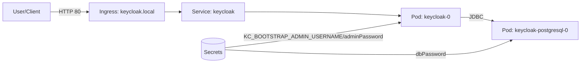

# Keycloak Kubernetes Environment (Namespace: keycloak)

This README logs the actions performed to create and verify the Keycloak Kubernetes environment in the `keycloak` namespace.

## Actions Performed

1. Created Keycloak admin and database secrets (Opaque).
   - File: `keycloak-secrets.yaml`
2. Wired Helm values to consume secrets and remove plaintext values.
   - File: `keycloak-values.yaml`
3. Added the Bitnami Helm repository (already present in this environment).
   - `helm repo add bitnami https://charts.bitnami.com/bitnami`
4. Installed/updated Keycloak using the Bitnami chart and the values file.
   - `helm upgrade --install keycloak bitnami/keycloak -n keycloak --create-namespace -f /home/rongoodman/Projects/keycloak/keycloak-values.yaml`
5. Switched to publicly available Bitnami images from AWS ECR Public and allowed non-standard images to avoid image pull failures.
   - Updated `keycloak-values.yaml`:
     - `image.registry: public.ecr.aws`
     - `postgresql.image.registry: public.ecr.aws`
     - `global.security.allowInsecureImages: true`
6. Added Keycloak resource requests/limits to prevent OOM crashes.
7. Recreated the PostgreSQL pod once to ensure it picked up the updated image.
8. Verified Keycloak health via a port-forward and HTTP 200 response from `/realms/master`.
   - `kubectl -n keycloak port-forward svc/keycloak 8080:80`
   - `curl -s -o /dev/null -w "%{http_code}\n" http://localhost:8080/realms/master`
   - Port-forward stopped after verification.

## Diagram

## Files in This Directory

- `keycloak-secrets.yaml` — Opaque secrets for admin and database credentials.
- `keycloak-values.yaml` — Helm values for the Bitnami Keycloak chart.

